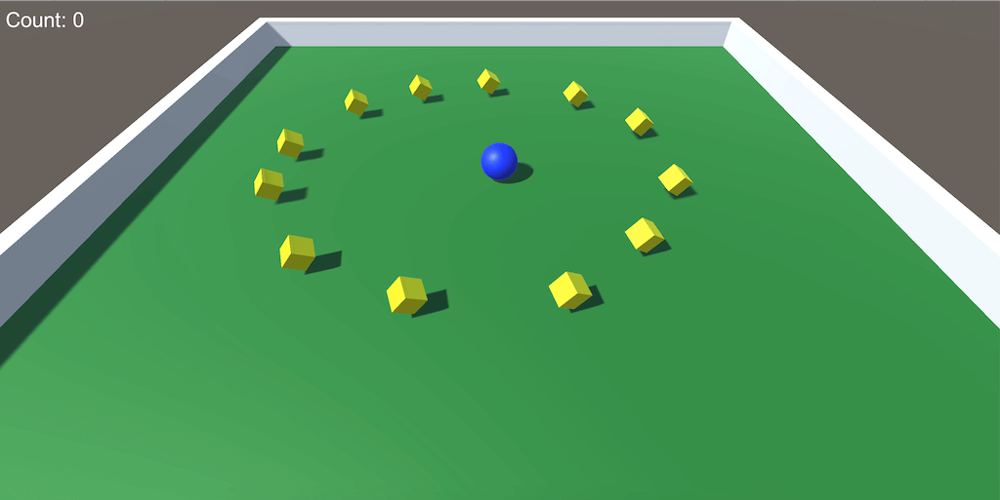

# Dizajn i programiranje računalnih igara 2019/2020

*Unity verzija: 2019.3.2f1*

### 1. vježba
Implementacija [Roll-a-ball](https://learn.unity.com/project/roll-a-ball-tutorial) igre

### 2. vježba
Terrain vježba uz korištenje [Nature Starter Kit 2](https://assetstore.unity.com/packages/3d/environments/nature-starter-kit-2-52977) asseta.

### 3. vježba
- Skybox
- Lighting
- Audio (AudioManger)

Korišteni asseti:
- [ENGINES](https://assetstore.unity.com/packages/audio/sound-fx/engines-123836)
- [FREE Battle Music Pack](https://assetstore.unity.com/packages/audio/music/orchestral/free-battle-music-pack-54023)
- [Skybox](https://assetstore.unity.com/packages/2d/textures-materials/sky/skybox-4183)

<!--

### 4. vježba

-->

<!--

### 5. vježba

-->

<!--

### 6. vježba

-->

<!--

### 7. vježba

-->

<!--

### 8. vježba

-->

<!--

### 9. vježba

-->

<!--

### 10. vježba

-->

<!--

### 11. vježba

-->

<!--

### 12. vježba

-->

<!--

### 13. vježba

-->

<!--

### 14. vježba

-->

<!--

### 15. vježba

-->
