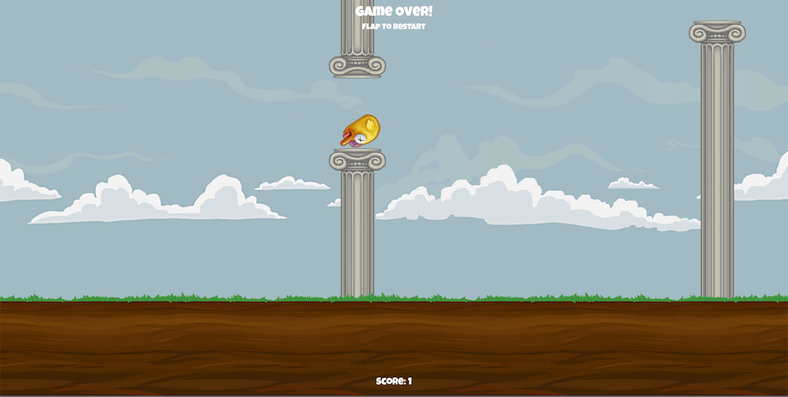

# Dizajn i programiranje računalnih igara 2019/2020

*Unity verzija: 2019.3.2f1*

## [1. vježba](Vj_1)
Implementacija [Roll-a-ball](https://learn.unity.com/project/roll-a-ball-tutorial) igre

## [2. vježba](Vj_2)
Terrain vježba uz korištenje [Nature Starter Kit 2](https://assetstore.unity.com/packages/3d/environments/nature-starter-kit-2-52977) asseta.

## [3. vježba](Vj_3)
- Skybox
- Lighting
- Audio (AudioManger)

Korišteni asseti:
- [ENGINES](https://assetstore.unity.com/packages/audio/sound-fx/engines-123836)
- [FREE Battle Music Pack](https://assetstore.unity.com/packages/audio/music/orchestral/free-battle-music-pack-54023)
- [Skybox](https://assetstore.unity.com/packages/2d/textures-materials/sky/skybox-4183)

## [4. vježba](Vj_4)

<h3 style="color:red">Rollin pumpkins</h3>

Used assets:

- [8-Bit Style Sound Effects](https://assetstore.unity.com/packages/audio/sound-fx/8-bit-style-sound-effects-68228) - *Blip_C_07* sound
- [8-bit 8 Pack Music Loops](https://assetstore.unity.com/packages/audio/music/electronic/8-bit-8-pack-music-loops-60232) - *Happy beats* sound
- [TGU Skybox Pack](https://assetstore.unity.com/packages/2d/textures-materials/sky/tgu-skybox-pack-96433) - *Urbanlight* skybox
- [Dark Wood Texture](https://assetstore.unity.com/packages/2d/textures-materials/wood/dark-wood-texture-11092) - *Wood512* texture
- [Bretwalda Halloween](https://assetstore.unity.com/packages/3d/props/food/bretwalda-halloween-74177) - *pumpkinCut* prefab

## [5. vježba](Vj_5)

2D Igra - Implementacija Flappy Bird igre s [unity tutoriala](https://learn.unity.com/tutorial/live-session-making-a-flappy-bird-style-game)

Potrebni asseti dostupni su u ovom [zipu](./Vj_5/flappy-bird-assets.zip)

## [6. vježba](Vj_6)

[Unity NavMesh](https://docs.unity3d.com/Manual/Navigation.html)

[Brackeys NavMesh tutorial](https://learn.unity.com/tutorial/unity-navmesh)

[NavMeshComponents](https://github.com/Unity-Technologies/NavMeshComponents/tree/2019.3)

## [7. vježba](Vj_7)

[Unity Animation](https://docs.unity3d.com/Manual/AnimationSection.html)

Used assets:

- [Nature Starter Kit 2](https://assetstore.unity.com/packages/3d/environments/nature-starter-kit-2-52977) - *ground01.tga* texture

